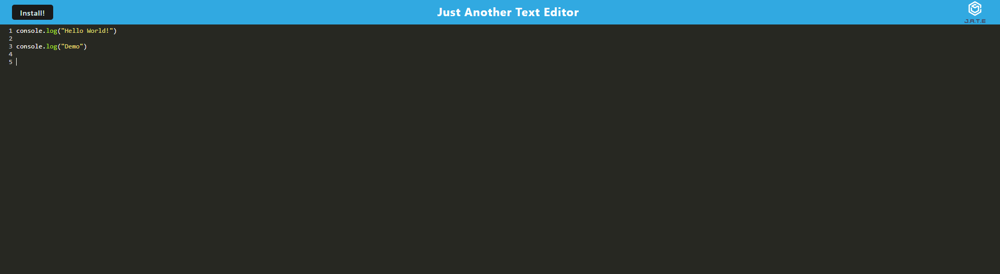

# trevors-web-text-editor
  

## Description  
A text editor site created using PWA.   

## Table of Contents  
* [Installation](#installation)  
* [Usage](#usage)  
* [Credits](#credits)  
* [License](#license)  
* [Contributing](#contributing) 
* [Questions](#questions)

## Installation  
To install necessary dependencies, run the following command:  

```  
npm install  
```  

## Usage  
This is another basic text editor that saves what you type in it into the database.  The site can be downloaded to your desktop and be used while offline.      
Site:   
      

## Credits  
Created by: Trevor Blanchard  
Link to repo: https://github.com/blanchardt/trevors-web-text-editor   
Link to heroku live site: https://trevors-web-text-editor-9ffa2909a838.herokuapp.com/  

## License  
This project is licensed under the MIT license.  

## Questions  
If you have any questions about the repo, open an issue or contact me directly at blanchardt@merrimack.edu.  You can find more of my work at [blanchardt](https://github.com/blanchardt/).  